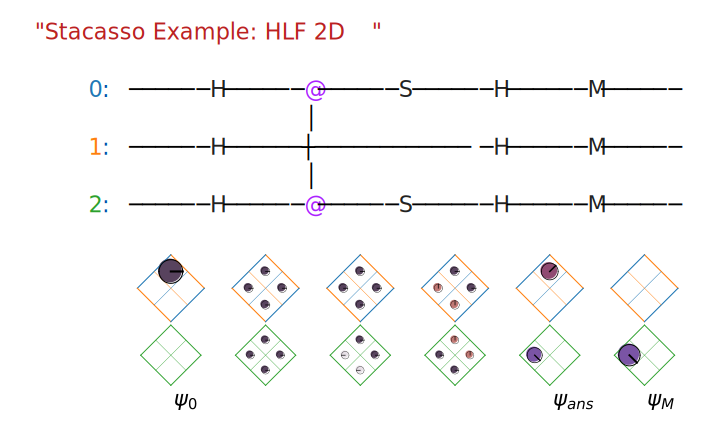

**Stacasso Readme**

v.0.0.1

Install with

```
pip install -e .
```

Uninstall with
```
pip uninstall stacasso
```

Stacasso is a Python library for visualizing quantum computing circuits.

The main repository resides on [GitHub](https://github.com/JonHub/stacasso).  The documentation (contained in the repository) can also be viewed online

* **[Stacasso README](https://jonhub.github.io/stacasso/)** (this file)
* [Introducing Stacasso (Notebook)](https://jonhub.github.io/stacasso/code/stacasso_introduction.html) (Introduction and Users's Guide, with Examples)


> NOTE, Stacasso is currently *alpha* code!  This is an initial, pre-release, to demonstrate features and get feedback.


The library builds upon and integrates with [Cirq](https://github.com/quantumlib/Cirq), the quantum computing framework.  Users can work within Cirq, and use Stacasso to:

* **Pretty-Print  Circuits**.  Adds color (syntax highlighting) and the ability to adjust spacing between gates <TODO> with displaying circuits.
* **Visualize Simulations**.  Plots the circuit's state space (Hilbert space) as a grid, and draws probabilities as disks to represent a given state.

Visualizing the state of the quantum computer, as it steps though a simulation, can give valuable insight as to how the calculation occurs.  The visualization is useful as a  a tool to learn/teach quantum computing, and also give insight into the computation, similar to a debugger when working with classical computing code.

For examples, the Stacasso library includes several useful quantum computing codes.  The codes are drawn from the google cirq tutorial, and demonstrate key features common in quantum computing codes.  (Note, these codes are opensourced by Google under the Apache 2.0 license.  They are included here under terms of that license.)

*  `bell_circuit()` creates an entangled pair of photons (qubits), is a fundamental starting point in quantum computation. (2 qubits)
* `tele()` implements the teleportation circuit, two parties, Alice and Bob, use an entangled qubit pair to send a Message. (3 qubits)
* `hlf()` is the "hidden linear function," the original "shallow code" designed to run on near-term quantum computing machines.  (3 or more qubits)

An example of a 3-qubit verison of the HLF2D problem is below.  The simulation starts off in initial state $\psi_0$, and contains two potential answers in the state just before the measurement, in $\psi_{ans}$.  The final measurement (collapse) only reveals one of the states.



The classical *probability* of being in a given state is represented by the *area* of the disk at that location, and the *amplitude* and *phase* are represented by the radius of the disk.  Phase is also encoded by the color of the disk.

Stacasso geometrically represents the full information of each state, at any time-step in the simulation.  The total areas of the probability disks adds to one, and all entries in state space are displayed, using tiling scheme to expand the gameboard, as more qubits are added.

The simulation space of a circuit with $n$ qubits is a cube, with $n$ dimensions.  For two and three qubits, this is easily represented as a square, or cube.  Stacasso draws these shapes, rotated and tiled, so all sides of the cube can be seen at the same time.

Quite a few interesting quantum circuits can be built with two or three qubits, and many building blocks in quantum computing can be broken down into these smaller circuit snippets.  The tiling scheme can also be extended for four, five, or more qubits.

Since drawing all sides of a cube was the artistic goal of the "cubist" painters, the name Stacasso is a tribute to the most famous cubist, State-space Picasso.


## Installing

Stacasso is currently stand-alone Python code.  To use, simply make sure the files in the `code` directory of the repository are in your directory.  You should be able to execute the `stacasso_introduction` notebook.

Note that the notebook will install google Cirq (using pip), if you do not already have it installed.


## Examples

For details on using Stacasso for visualizing quantum computation, see the ["Stacasso Introduction" notebook](https://jonhub.github.io/stacasso/code/stacasso_introduction.html) .  The notebook (code) is available in this repository [/code/stacasso_introduction.ipynb](/code/stacasso_introduction.ipynb).  (Note that GitHub renders the notebook oddly.  As a workaound, the notebook was executed to `.html`, and made avaible through GitHub Pages.)

The notebook contains a number of examples, giving a visual representation of concepts in quantum computing.  The central ideas is that Stacasso represents state space (Hilbert Space) like a gameboard, and draws the states on the gameboard as "probabilty-amplitude disks" (PADs).
    
Displaying the states this way allows *all* of the state's information to be represented on the screen at one time.  Quantum circuits step the states from the initial state to the final state, in a number of discrete steps.  By drawing the states at each step, or at the crucial steps, it is possible to "see" how the computation unfolds.

* **Visualizing Amplitudes and Probabilites** - quantum information is contained as vectors (like numpy arrays) of complex *amplitudes*, rather than the real-valued *probabilities* in classical theory.  Stacasso represents these values as "probability/amplitude disks" (PADs).  The size of the disk is proportional to the classical probability (change of being in that state, if measured), with the radius of the disk proportional to the magnitude of the amplitude.  Phase is encoded in the orientation of the "dial," as well as the color of the disk.

* The **Bell State** is one of the simplest, and most important quantum circuts.  Since the circuit uses only two qubits, the representation in Stacasso is easy to follow.

* **Quantum Teleportation** is a fundamental three-qubit circuit.  It demonstrates secure communication ("teleportation of information"), using entangled qubits.

* **HLF 2D** is the (two-dimensional) "Hidden Linear Function" problem, a significant quantum computing problem (and solution) discovered in 2018.  The circuit is an example of a "shallow code," designed to finish computing in a short amout of time (small number of operations, many of which can be accomplished in parallel).  Shallow codes can be run on today's quantum computing hardware.

## Project Goals

Create usable, useful software for visualizing quantum computation.  This includes:

Work on the pretty-print, including adding the spacing, and converting into svg (or html) ... may need to create syntax highlighting package (???), insure that the qubits are colored correctly, and work with cirq's text generation (to add the additional spaces?)

Work on the visualizations - specifically, labeling the states (graphically), and ordering them correctly (from returned values from the simulation).

Git (lol) the code into Google "contrib" ... need to start there, to make sure directory structure and such are okay.  Goal should be work towards integration, but not start util the code is mostly correct.  How to [Contribute to Google Cirq](https://github.com/quantumlib/Cirq/blob/master/CONTRIBUTING.md) ... 

## TODO

This code is currently early-stage alpha code, under active development.  Below is a partial list of task/features to add.  
    
* Circuits need to print into HTML, with the font included so they can be added reliably to the plots (the svg.)  The HTML can also be rendered directly, but this should be the intermediate format ...

  Generate the HTML, using the Google Cirq code?  Download and understand the Google Cirq code, including the directory structure ...

  The generated HTML can ALSO return plot locations (places to draw the state-space vectors).  Getting the HTML text working could take two or three days ... but then, most of the project.
  
  Need to be able to add in additional spaces, as well.

* Figure out circuit ordering (and labels) ... this is crucial!  Also, add labels for states (much simpler).

---


## Errata

Different quantum computing algorithms create distinct patterns when visualized, and many quantum computation features (such as collapse or cancellation of probabilities) are immediately recogognizable.

The state space (also called Hilbert space) can be thought of as game board, like the board on which you would play chess or checkers.  Rather than move around game pieces, quantum computers shuffle around *amplitudes*, values that represent the probabilities (and phase) of being in that state.

Stacasso draws this rotated into a diamond, to create a symmetry between the two qubits, and to make state statespace representation visually distinctive.

