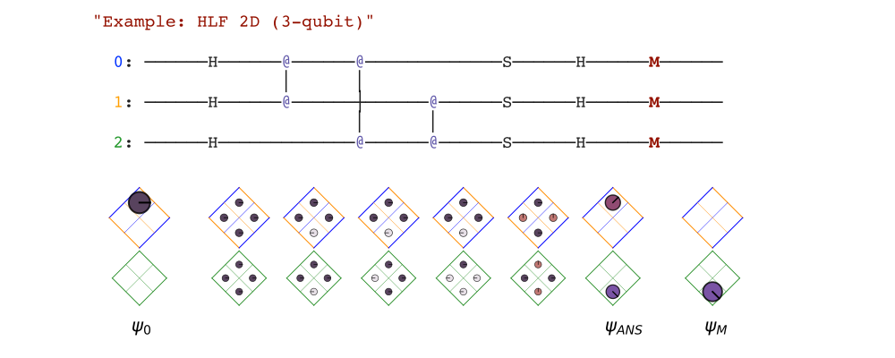
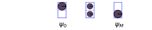
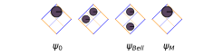
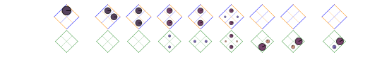
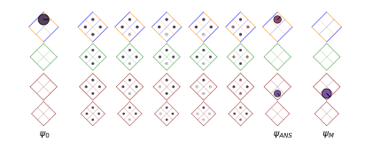

> Stacasso README, from [GitHub](https://github.com/JonHub/stacasso).
>
> Best viewed at [jonhub.github.io/Stacasso](jonhub.github.io/Stacasso).

Stacasso is a Python library for displaying and visualizing quantum computing circuits.



Stacasso works on top of [Cirq](https://github.com/quantumlib/Cirq), the open-source, widely supported quantum computing framework.  Cirq is used to create and simulate circuits.  Stacasso adds:

* **Syntax highlighting** for quantum computing circuits (color and formatting).  Output can be displayed directly to the screen ("pretty-print"), or returned as `.html` strings for display elsewhere.
* **Visualization** of the circuit execution, by drawing wave function amplitudes (probabilities) in state space.  Circuits simulations can be "illustrated" as they execute, from start to finish, with a single function call.

> Please note Stacasso is currently in beta release.  Features are being added and improved.  Currently, syntax highlighting should work on any circuit.  Illustrations work on circuits up to four qubits.

These tools can be used to understanding and creating quantum circuits, in the same way that syntax highlighting and debugging tools have become indispensable tools in other computing languages.

To get started using Stacasso, see [installing](#installing), below.

The [examples](#examples) (below) walk through creating and illustrating 1, 2, 3, and then 4-qubit circuits, using Cirq and Stacasso.  These four circuits build on each other conceptually, and introduce many of the key concepts in quantum computation (superposition, entanglement, probability/amplitudes, phase).

Many of these concepts in quantum computing have a direct visual counterpart.

More information can be found in the [Stacasso Guide (Notebook)](https://jonhub.github.io/stacasso/notebooks/stacasso_guide.html).  The notebook is part of Stacasso, and can be executed locally, as a starting point for exploring quantum computation.  Note that the guide (as well as the Stacasso project) is currently usable, but a work in progress


For more information on quantum computing using Cirq, see

* [Introduction to Cirq](https://quantumai.google/cirq/tutorials/educators/intro)

* [Cirq basics](https://quantumai.google/cirq/tutorials/basics)

Stacasso is opensource and free, licensed under Apache 2.0.  Stacasso also uses code from Cirq, used here under the terms of their license (also Apace 2.0).  Stacasso also draws circuits from the [Cirq Tutorials](https://quantumai.google/cirq/tutorials), and are incorporated into Stacasso under terms of their license.

#### Installing

Stacasso is a python package, and can be installed using pip.

Download (or clone) a local copy from [GitHub](https://github.com/JonHub/stacasso).  Change to that directory, and install with

```
pip install -e .
```

Uninstall with:

```
pip uninstall stacasso
```

You should now be able to execute the `stacasso_guide` notebook.  Note that the notebook will install google Cirq (using pip), if it is not aready installed..

#### Examples

A few examples of common quantum computing circuits, illustrated with Stacasso, will make the usage more clear.

> (Note, these images do not render correctly on GitHub.  Make sure you are viewing the file at  [jonhub.github.io/Stacasso](jonhub.github.io/Stacasso)]([jonhub.github.io/Stacasso](jonhub.github.io/Stacasso)).

##### Quantum Random Number Generator (1-qubit)

We can make and illustrate a simple 1 qubit quantum circuit with:

```python
import cirq
import stacasso as so

# Quantum Random Number Generator 

# first, make the circuit, using cirq
qrng_circuit = cirq.Circuit()
q0 = cirq.NamedQubit('qubit 0')
qrng_circuit.append(cirq.H(q0))
qrng_circuit.append(cirq.measure(q0))

# labeling the states is optional
labels = ['$\psi_0$', '', '$\psi_M$']

# print and illustrate with Stacasso
so.pprint( qrng_circuit, '"Quantum Random Number Generator (QRNG)"' )
so.illustrate( qrng_circuit, labels )
```


<div>
<pre style="white-space:pre;font-size:medium;background:white;line-height:normal;font-family:monospace;">  <span style="color:Maroon">"Quantum Random Number Generator (QRNG)"</span><br><br>    <span style="background-color:WhiteSmoke;color:Blue">qubit 0</span>: ──────H──────<span style="background-color:WhiteSmoke;color:Maroon;font-weight:bold">M</span>──────<br></pre>
</div>
<div></div>

Notice that the wave function (the state of the algorithm) is drawn as a grid below the circuit, like a game board.  A single qubit has two states, so there are two squares, drawn on top of each other.

Probabilities are visualized as colored disks, with the area proportional to the probability of being measured in that state.  The (complex) amplitude is the radius of the disk, with the phase encoded by the disk orientation (the "dial"), as well as color.

##### Bell Circuit (2-qubits)

The above circuit can be extended, by entangling the first qubit with a second.  This creates the classic Bell State, where the result of operations on the first qubit, such as measurement, are inextricably linked to the second qubit.

```python
import cirq
import stacasso as so

# Bell Circuit

bell_circuit = so.make_bell_circuit()

# make labels (optional)
labels = ['$\psi_0$',
          '',
          '$\psi_{Bell}$',
          '$\psi_M$']

so.pprint(bell_circuit,'"Bell State Circuit"')
so.illustrate(bell_circuit, labels)

```

<div>
<pre style="white-space:pre;font-size:medium;background:white;line-height:normal;font-family:monospace;">  <span style="color:Maroon">"Bell State"</span><br><br>    <span style="background-color:WhiteSmoke;color:Blue">q0</span>: ──────H──────<span style="color:MediumSlateBlue">@</span>──────<span style="background-color:WhiteSmoke;color:Maroon;font-weight:bold">M</span>──────<br>                     │      │<br>    <span style="background-color:WhiteSmoke;color:DarkOrange">q1</span>: ─────────────X──────<span style="background-color:WhiteSmoke;color:Maroon;font-weight:bold">M</span>──────<br></pre>
</div>
<div></div>

For this circuit, and any circuit with two or more qubit circuits, `Stacasso` draws the state space matrix rotated by 45 degrees, for visual clarity.

##### Quantum Teleportation (3-qubits)

(Circuit from [Google Cirq Tutorial](https://quantumai.google/cirq/tutorials/educators/textbook_algorithms#quantum_teleportation).)

The teleportation circuit uses the Bell State to send the a message.  Entangled qubits (the Bell State) are shared by Alice and Bob, who may be located physically very distant from each other.  Alice entangles the message (encoded as a quantum state) into her qubit, and Bob is then able to read the meassage from his (entangled) qubit.

<div>
<pre style="white-space:pre;font-size:medium;background:white;line-height:normal;font-family:monospace;">  <span style="color:Maroon">"Quantum Teleportation"</span><br><br>    <span style="background-color:WhiteSmoke;color:Blue">0 (Ali)</span>: ──────H──────<span style="color:MediumSlateBlue">@</span>─────────────────X─────────────<span style="background-color:WhiteSmoke;color:Maroon;font-weight:bold">M</span>──────<span style="color:MediumSlateBlue">@</span>─────────────<br>                          │                 │             │      │<br>    <span style="background-color:WhiteSmoke;color:DarkOrange">1 (Bob)</span>: ─────────────X─────────────────┼─────────────┼──────X──────<span style="color:MediumSlateBlue">@</span>──────<br>                                            │             │             │<br>    <span style="background-color:WhiteSmoke;color:ForestGreen">2 (Msg)</span>: ────────────────────X^0.3──────<span style="color:MediumSlateBlue">@</span>──────H──────<span style="background-color:WhiteSmoke;color:Maroon;font-weight:bold">M</span>─────────────<span style="color:MediumSlateBlue">@</span>──────<br></pre>
</div>

<div></div>

Since the original message disappears (the "no cloning" rule in quantum mechanics), the value contain on that qubit is said to have been "teleported."  Notice that since this circuit contains a measurement, the results are stochastic; sometimes, the message is teleported, sometimes it is not.

In a typical quantum computing application, an algorithm is run many times.  Running `so.illustrate(circuit)` multiple times is a good way to gain understanding of the stochastic nature of measurement and collapse in quantum computing.

##### HLD 2D (n-qubits)

(Circuit from [Google Cirq Tutorial](https://quantumai.google/cirq/tutorials/hidden_linear_function).  See "[Quantum advantage with shallow circuits](https://arxiv.org/abs/1704.00690)" for the original paper.)

The "Hidden Linear Function, 2-dimensional" problem was the first "shallow code," introduced in 2018.  *Shallow* refers to the number of steps that the circuit takes; the idea is to perform a useful computation quickly, before the quantum state of the computer has time to collapse.


<div>
<pre style="white-space:pre;font-size:medium;background:white;line-height:normal;font-family:monospace;">  <span style="color:Maroon">"HLF 2D"</span><br><br>    <span style="background-color:WhiteSmoke;color:Blue">0</span>: ──────H──────<span style="color:MediumSlateBlue">@</span>──────<span style="color:MediumSlateBlue">@</span>─────────────S──────H──────<span style="background-color:WhiteSmoke;color:Maroon;font-weight:bold">M</span>──────<br>                    │      │<br>    <span style="background-color:WhiteSmoke;color:DarkOrange">1</span>: ──────H──────<span style="color:MediumSlateBlue">@</span>──────┼──────<span style="color:MediumSlateBlue">@</span>──────S──────H──────<span style="background-color:WhiteSmoke;color:Maroon;font-weight:bold">M</span>──────<br>                           │      │<br>    <span style="background-color:WhiteSmoke;color:ForestGreen">2</span>: ──────H─────────────┼──────┼─────────────H──────<span style="background-color:WhiteSmoke;color:Maroon;font-weight:bold">M</span>──────<br>                           │      │<br>    <span style="background-color:WhiteSmoke;color:DarkRed">3</span>: ──────H─────────────<span style="color:MediumSlateBlue">@</span>──────<span style="color:MediumSlateBlue">@</span>──────S──────H──────<span style="background-color:WhiteSmoke;color:Maroon;font-weight:bold">M</span>──────<br></pre>
</div>

<div></div>

The HLF 2D probelm is useful, in that it can scale to essentially any size (any number of qubits).  Note that the correct solutions to the problem are contain in the final wavefunction, before the measurement.  In this case there are two solutions (zero is always a solution), though only one solution is apparent after measurement.

#### More Qubits

Quite a few interesting quantum circuits can be built with two or three qubits, and many building blocks in quantum computing can be broken down into these smaller circuit snippets.

The tiling scheme can also be extended to five or more qubits, and in principle, Stacasso should be able to visualize higher dimensional circuits, such as quantum error correction.  (Planned for future relases).

The wave function which describe a quantum system can be thought of living inside of a "state space" (or "Hilbert space), which is shaped like a high-dimensional cube.  Stacasso attempts to draw this space, in a logical and useful manner, to provide insight.

Since drawing all sides of a cube was the artistic goal of the "cubist" painters, the name Stacasso is a tribute to the most famous cubist: (State Space) Picasso.

#### License

Stacasso is licened under the Apache 2.0 License.

The code uses parts of the [Google Cirq]() project (also under Apache 2.0 License), used here under terms of that license.


#### Contributing

The repository is new and contains beta code, and currently not accepting contributions at this time.  Please check back, as we would like to be able to accept contributions at some point in the future.

#### Future Work

(Internally, the code could to be cleaned up and refactored.)

* [ ] The goal is to get `Stacasso` usable, and then get it integrated into Google's cirq `contributing` folder, see [Contribute to Google Cirq](https://github.com/quantumlib/Cirq/blob/master/CONTRIBUTING.md) ... 

* [ ] Larger qubits would be interesting to visualize.  In this case, the gameobard would have to be stepped (or animated).  For instance, ten qubits needs 1024 states, but could be used to show error correction, such as the Shore code (9-qubits).

* [ ] Snytax highlighting can be expanded to include numbers, and qubit names (right justify), when they are different lenths.