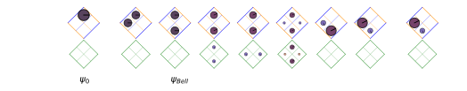
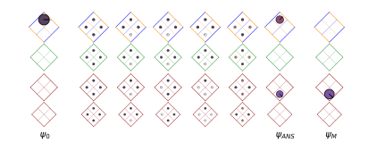

### Stacasso README


Stacasso is a Python library for visualizing quantum computing circuits.  This includes syntax highlighting, as well as  illustrating the evolving statevector as the algorithm executes.

The main repository resides on [GitHub](https://github.com/JonHub/stacasso).  The documentation (contained in the repository) can also be viewed online

* **[Stacasso README](https://jonhub.github.io/stacasso/)** (this file)
* [Stacasso Guide (Notebook)](https://jonhub.github.io/stacasso/notebooks/stacasso_guide.html) (Introduction and Users's Guide, with Examples)

> NOTE, Stacasso is currently *alpha* code!  This is an initial, pre-release, to demonstrate features and get feedback. Attempts will be made do document missing features / upcoming features, but be aware that code and interface may change.

Stacasso integrates with [Cirq](https://github.com/quantumlib/Cirq), the quantum computing framework, which is used to create and simulate the circuits.  Stacasso adds the ability  Users can work within Cirq, and use Stacasso to:

* **Pretty-Print  Circuits**.  Adds color (syntax highlighting) to circuits.  Outputs can be displayed to the screen, or returned as `.html` strings, for display elsewhere.
* **Visualize Simulations**.  Illustrates a circuit's wavefunction evolution, as by drawing probabilities (amplitudes) in a state space.

For more information on using Cirq, see

* [Introduction to Cirq](https://quantumai.google/cirq/tutorials/educators/intro)

* [Cirq basics](https://quantumai.google/cirq/tutorials/basics)

Stacasso is opensource and free, licensed under Apache 2.0.  Stacasso also uses code from Cirq, used here under the terms of their license (also Apace 2.0).  Stacasso also draws circuits from the [Cirq Tutorials](https://quantumai.google/cirq/tutorials), and are incorporated into Stacasso under terms of their license.

#### Installing

Stacasso is a python package, and can be installed using pip.

Download (or clone) a local copy from [GitHub](https://github.com/JonHub/stacasso).  Change to that directory, and install with

```
pip install -e .
```

Uninstall with:

```
pip uninstall stacasso
```

You should now be able to execute the `stacasso_introduction` notebook.  Note that the notebook will install google Cirq (using pip), if you do not already have it installed.

#### Examples

##### Quantum Random Number Generator (1-qubit)

We can make and illustrate a simple 1 qubit quantum circuit with:

```python
import cirq
import stacasso as so

# Quantum Random Number Generator 

# first, make the circuit, using cirq
qrng_circuit = cirq.Circuit()
q0 = cirq.NamedQubit('qubit 0')
qrng_circuit.append(cirq.H(q0))
qrng_circuit.append(cirq.measure(q0))

# labeling the states is optional
labels = ['$\psi_0$', '', '$\psi_M$']

# print and illustrate with Stacasso
so.pprint( qrng_circuit, '"Quantum Random Number Generator (QRNG)"' )
so.illustrate( qrng_circuit, labels )
```


<div>
<pre style="white-space:pre;font-size:medium;background:white;line-height:normal;font-family:monospace;">  <span style="color:Maroon">"Quantum Random Number Generator (QRNG)"</span><br><br>    <span style="background-color:WhiteSmoke;color:Blue">qubit 0</span>: ──────H──────<span style="background-color:WhiteSmoke;color:Maroon;font-weight:bold">M</span>──────<br></pre>
</div>
<div></div>

State space is drawn as a grid below the circuit (like a game board).  Probabilities are visualized as colored disks, with the area proportional to the probability of being in that state, if measured.  The phase of the underlying amplitude in encoded in the disk color, as well as the orientation of the "dial" (radius) of the disk.

##### Bell Circuit (2-qubits)

The above circuit can be extended, by entangling the first qubit with a second.  This creates the classic Bell State, and the circuit demonstrates many fundamental quantum computing concepts.  (Initial state, superposition, entanglement, and collapse.)

```python
import cirq
import stacasso as so

# Bell Circuit

bell_circuit = so.make_bell_circuit()

# make labels (optional)
labels = ['$\psi_0$',
          '',
          '$\psi_{Bell}$',
          '$\psi_M$']

so.pprint(bell_circuit,'"Bell State Circuit"')
so.illustrate(bell_circuit, labels)

```

<div>
<pre style="white-space:pre;font-size:medium;background:white;line-height:normal;font-family:monospace;">  <span style="color:Maroon">Bell State</span><br><br>    <span style="background-color:WhiteSmoke;color:Blue">q0</span>: ──────H──────<span style="color:MediumSlateBlue">@</span>──────<span style="background-color:WhiteSmoke;color:Maroon;font-weight:bold">M</span>──────<br>                     │      │<br>    <span style="background-color:WhiteSmoke;color:DarkOrange">q1</span>: ─────────────X──────<span style="background-color:WhiteSmoke;color:Maroon;font-weight:bold">M</span>──────<br></pre>
</div>
<div></div>

Note that for circuits with two or more qubit circuits, `Stacasso` draws the state space matrix rotated by 45 degrees, for visual clarity.

##### Quantum Teleportation (3-qubits)

This circuit builds on the above circuit.  The entangled qubits created are shared by Alice and Bob, who may be located physically very distant from each other.  Alice entangles the message (encoded as a quantum state) into her qubit, and Bob is then able to read the meassage from his (entangled) qubit.

<div>
<pre style="white-space:pre;font-size:medium;background:white;line-height:normal;font-family:monospace;">  <span style="color:Maroon">"Quantum Teleportation"</span><br><br>    <span style="background-color:WhiteSmoke;color:Blue">0 (Ali)</span>: ──────H──────<span style="color:MediumSlateBlue">@</span>─────────────────X─────────────<span style="background-color:WhiteSmoke;color:Maroon;font-weight:bold">M</span>──────<span style="color:MediumSlateBlue">@</span>─────────────<br>                          │                 │             │      │<br>    <span style="background-color:WhiteSmoke;color:DarkOrange">1 (Bob)</span>: ─────────────X─────────────────┼─────────────┼──────X──────<span style="color:MediumSlateBlue">@</span>──────<br>                                            │             │             │<br>    <span style="background-color:WhiteSmoke;color:ForestGreen">2 (Msg)</span>: ────────────────────X^0.3──────<span style="color:MediumSlateBlue">@</span>──────H──────<span style="background-color:WhiteSmoke;color:Maroon;font-weight:bold">M</span>─────────────<span style="color:MediumSlateBlue">@</span>──────<br></pre>
</div>

<div></div>

##### HLD 2D (n-qubits)

The "Hidden Linear Function, 2-dimensional" problem was the first "shallow code," introduced in 2018.

<div>
<pre style="white-space:pre;font-size:medium;background:white;line-height:normal;font-family:monospace;">  <span style="color:Maroon">"HLF 2D"</span><br><br>    <span style="background-color:WhiteSmoke;color:Blue">0</span>: ──────H──────<span style="color:MediumSlateBlue">@</span>──────<span style="color:MediumSlateBlue">@</span>─────────────S──────H──────<span style="background-color:WhiteSmoke;color:Maroon;font-weight:bold">M</span>──────<br>                    │      │<br>    <span style="background-color:WhiteSmoke;color:DarkOrange">1</span>: ──────H──────<span style="color:MediumSlateBlue">@</span>──────┼──────<span style="color:MediumSlateBlue">@</span>──────S──────H──────<span style="background-color:WhiteSmoke;color:Maroon;font-weight:bold">M</span>──────<br>                           │      │<br>    <span style="background-color:WhiteSmoke;color:ForestGreen">2</span>: ──────H─────────────┼──────┼─────────────H──────<span style="background-color:WhiteSmoke;color:Maroon;font-weight:bold">M</span>──────<br>                           │      │<br>    <span style="background-color:WhiteSmoke;color:DarkRed">3</span>: ──────H─────────────<span style="color:MediumSlateBlue">@</span>──────<span style="color:MediumSlateBlue">@</span>──────S──────H──────<span style="background-color:WhiteSmoke;color:Maroon;font-weight:bold">M</span>──────<br></pre>
</div>

<div></div>

#### More Qubits

Visualizations can be extended to three (and higher) qubits, which can be thought of as cubes in three (and higher) dimensions.  `Stacasso` attempts to draw higher dimensional cubes (hypercubes) by duplicating and tiling the game board (state space representation) for each additional qubit added.

Quite a few interesting quantum circuits can be built with two or three qubits, and many building blocks in quantum computing can be broken down into these smaller circuit snippets.  The tiling scheme can also be extended for five, or more qubits.

Since drawing all sides of a cube was the artistic goal of the "cubist" painters, the name Stacasso is a tribute to the most famous cubist, State-space Picasso.

Stacasso currently supports visualizations of up to four qubit circuits, with plans to support higher numbers in the future. 


#### License

Stacasso is licened under the Apache 2.0 License.

The code uses parts of the [Google Cirq]() project (also under Apache 2.0 License), used here under terms of that license.


#### Contributing

The repository is new and contains alpha code, and currently not accepting contributions at this time.  Please check back, as we would like to be able to accept contributions at some point in the future.

#### Future Work

(Internally, the code could to be cleaned up and refactored.)

The goal is to get `Stacasso` usable, and then get it integrated into Google's cirq `contributing` folder, see [Contribute to Google Cirq](https://github.com/quantumlib/Cirq/blob/master/CONTRIBUTING.md) ... 

Larger qubits would be interesting to visualize.  In this case, the gameobard would have to be stepped (or animated).  For instance, ten qubits needs 1024 states, but could be used to show error correction, such as the Shore code (9-qubits).

Larger HLF2D problems would be interesting, as well as the shallow code that ran on Google's Sycamore (need to dig out that reference).


